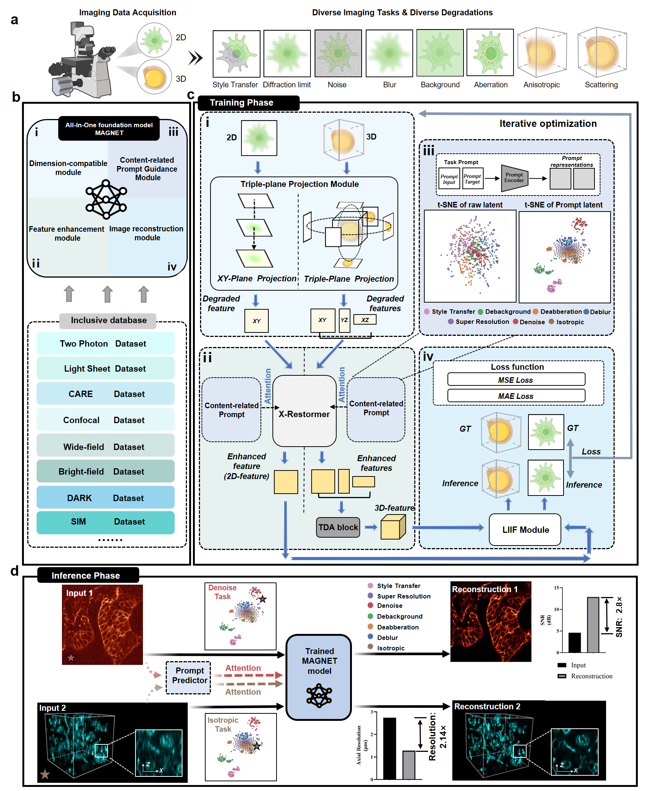

# MAGNET

 A awesome 2D/3D-compatible multitasks foundation model for fluorescence image restoration proposed in our [paper](https://www.biorxiv.org/content/10.64898/2025.12.23.696141v1)🚀



## system requirement
✅ Windows Server 2022 Datacenter  
✅ Graphics: Nvidia GPU (RTX 4090 recommended)
✅ Python 3.10 (64 bit)  

## Get start 
📦First, you need to create a conda envirenment
```
conda create -n MAGNET python=3.10
```
📦Second, we recommend to install Pytorch 2.0.1 with CUDA 11.8 by this command:
```
conda install pytorch==2.0.1 torchvision==0.15.2 torchaudio==2.0.2 pytorch-cuda=11.8 -c pytorch -c nvidia
```
📦Tired, set the root dir into MAGNET-main/code and install the packages for environment required
```
pip install -r requirements.txt
```
📦Or you can download these packages manually.
```
numpy==1.26.4
pandas
configargparse
tqdm
timm
unfoldNd
scipy
einops
scikit-image
easydict
omegaconf
matplotlib
seaborn
```

## Usage
⚡️You can download the example [data](https://drive.google.com/file/d/18VZu6ECumIIuoklUB4lSti_07J3vpMbF/view?usp=sharing), 
[checkpoint](https://drive.google.com/file/d/1t-OuT0Maa6IaQGGP_p0uF4ZVEqiVWhcu/view?usp=sharing) and 
[prompt](https://drive.google.com/file/d/1yPXiuMeIk2o3U6lm4kVPW45uUI4Fh3AN/view?usp=sharing), 
unzip them and put the subfolder under magnet-main like this:
```
MAGNET___code...
    |____example___2d_input...
    |         |___3d_input...
    |         |___...
    |
    |____prompt...
    |____pretrain...
    ...
```
### Inference

#### 2D/3D image Inference
⚡️Change the root directory to MAGNET. Then you can run this to inference a .tif file. You can change the parameters as you need.
```
python code/main.py --config code/configsfile/config_pred.txt
```
#### Isotropic
⚡️Isotropic task takes a 3D images as input.
```
python main.py --config code/configsfile/config_pred_iso.txt
```
#### Virtual Stain
⚡️Virtual Stain task transfers a 1 channel fluorescence image to a 3 channel RGB image with virtual H&E stain.
```
python main.py --config code/configsfile/config_pred_VST.txt
```
### Pretrain
#### Datasets
📝Before you pretrain MAGNET from scratch, you can try our demo datasets [here](#usage). Or you can use your own data to train.
A data folder for our training frame has to be like this:
```
BioSR_NM_benchmark____CCPs____train____input...
                 |       |        |____target...
                 |       |
                 |       |____test____input__________img0.tif
                 |       |       |____target... |____img1.tif
                 |       |                      |____...
                 |       |____prompt____input...
                 |                 |____target____img0.tif
                 |____F_actin...             |____img1.tif
                 |____Microtubules...        |____...
                 |____ER...
```
In this frame 'BioSR_NM_benchmark' represents a ```multi-task folder``` when 'CCPs' represents a ```single-task folder``` 
Each multi-task folder contains at least a single-task folder.
Each single-task contains ```train``` ```test``` and ```prompt```(optional) folders, and each of them contains a ```input``` folder and a ```target``` folder, which content ```LQ``` images and ```HQ``` images.

#### Train from scratch
🔥In this section you can train MAGNET from scratch follow our steps.
First, you need to select a config file for the main.py. For example:
```MAGNET/code/ConfigsFile/config_train.txt```.
You can modify the parameters in the config file you selected as you need, For example:
```
expname                 =   MAGNET_TRAIN                # Log folder name
action                  =   TRAIN_DDP                   # Train or Evaluate
loading_MT_ckpt_path    =   None                        # checkpoint_path
task_idx                =   0                           # 0->Denoise, 1->SR,...
MT_data_config          =   ./multi_data_info_XR.yaml   # datasets info
...
```
Second, the parameter ```MT_data_config``` in the config file represents the datasets information.
For example, ```magnet-main/code/multi_data_info_XR.yaml```. Edit the parameter ```'data_path'``` to your
multi-task folders or single-task folders.

Then, you can run training process with:
```
python code/main.py --config code/configsfile/config_train.txt
```

### Self-supervised test-time tuning with system psf
🔥In this section you can finetune a pretrained MAGNET with self-supervised learning.
the corresponding config file is ```MAGNET/code/ConfigsFile/config_train_ssl.txt```. 
Assign the path of your system PSF to the variable ```psf_dir``` in it.
```
expname                 =   MAGNET_TTO                  # Log folder name 
action                  =   SSL                         # Log folder name
MT_model_name           =   MultiModel_X_light          # model
loading_MT_ckpt_path    =   pretrain/magnet_ckpt.tar # checkpoint
task_idx                =   0                           # self reconstruction
output_size             =   256                         # suppose to align the input size
psf_dir                 =   code/psf/cart488/psf.tif       # path to your psf file
...
```
besides,the dataset of Zero-shot do not need ```target``` folders.
Then you can run TTO process with:
```
python code/main.py --config code/configsfile/config_train_ssl.txt
```

### Prompt Predictor training
🔥In this section you can train a prompt predictor with a pretrained checkpoint of MAGNET.
the corresponding config file is ```MAGNET/code/ConfigsFile/config_train_pdor.txt```. 

You can run prompt Predictor training process by this command:
```
python code/main.py --config code/configsfile/config_train_pdor.txt
```
🤝Any discussion, feedback, or collaboration is highly welcome!